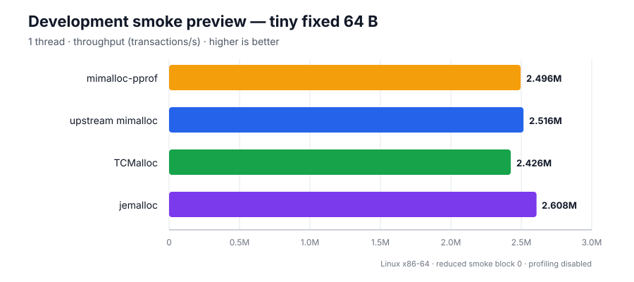

# mimalloc-pprof

> ## mimalloc with native pprof-compatible heap profiling — on Windows, Linux, and macOS alike.
>
> **The one mimalloc heap profiler that runs natively on Windows.** Upstream mimalloc
> has no profiler at all, and the only other known implementation
> ([Bun's](https://github.com/oven-sh/mimalloc), surveyed in
> [`MIMALLOC_FORKS.md`](MIMALLOC_FORKS.md)) is POSIX-only — its stack capture is guarded
> behind glibc/Apple `<execinfo.h>`.

A fork of [microsoft/mimalloc](https://github.com/microsoft/mimalloc) that adds
**pprof-compatible sampled heap profiling**, with native Windows as a first-class
target alongside Linux and macOS.

## Allocator benchmark preview



**Development smoke preview only.** This is one Linux x86-64 reduced-smoke block
for the 1-thread `tiny-fixed-64` cell, with profiling and memory-events collection
disabled. One block is not statistically valid and this is not a headline
benchmark result; it is shown only as an early end-to-end preview while the full
benchmark suite is completed.

```
   __  __ ___ __  __    _    _     _     ___   ____
  |  \/  |_ _|  \/  |  / \  | |   | |   / _ \ / ___|
  | |\/| || || |\/| | / _ \ | |   | |  | | | | |
  | |  | || || |  | |/ ___ \| |___| |__| |_| | |___
  |_|  |_|___|_|  |_/_/   \_\_____|_____\___/ \____|

   ____  ____  ____   ___  _____
  |  _ \|  _ \|  _ \ / _ \|  ___|
  | |_) | |_) | |_) | | | | |_
  |  __/|  __/|  _ <| |_| |  _|
  |_|   |_|   |_| \_\\___/|_|

      PPROF-COMPATIBLE SAMPLED HEAP PROFILING
      WINDOWS FIRST-CLASS | LINUX | MACOS


    malloc / free
          |
          v
          +------------------+
          |     mimalloc     |
          |       |
          |   [ live heap ]  |
          +---------+--------+
         |
         | sampled allocations
         v
+------------------+      +--------------------------+
|    heap.prof     | ---> |      google/pprof        |
| heap_v2 / proto  |      | flamegraphs | top | diff |
+------------------+      +--------------------------+
```

The allocator tracks sampled live allocations and writes either the gperftools
`heap_v2` text format or an uncompressed pprof `profile.proto`. Both open directly
in [google/pprof](https://github.com/google/pprof) for flame graphs, call graphs,
top reports, and profile diffs.

Profiling is **opt-in at runtime**: a build with `MI_PPROF=ON` (the default) does
not sample until you call a start API or set `MIMALLOC_PROF=1`.

**Platforms.** Linux, macOS, and Windows — with both **MSVC and MinGW** as required
CI targets, on every commit, in Debug and Release. MinGW being a gate rather than an
afterthought is how the leaks in [Bugs fixed in older
versions](#bugs-fixed-in-older-versions) were found; upstream has no MinGW job.

**Contents**

- [Quick start](#quick-start)
- [Choosing a version: v2 or v3](#choosing-a-version-v2-or-v3)
- [Bugs fixed in older versions](#bugs-fixed-in-older-versions) — including two unbounded memory leaks
- [What this fork carries](#what-this-fork-carries-and-where-each-piece-came-from) — every divergence, with its source
- [C and C++ integration](#c-and-c-integration)
- [Rust integration](#rust-integration)
- [Profiler reference](#profiler-reference)
- [Memory-events API](#memory-events-api)
- [For maintainers](#for-maintainers)

---

## Quick start

### Rust

```toml
[dependencies]
mimalloc-pprof = "0.9"

[profile.release]
debug = "line-tables-only"
strip = false
```

```rust
use mimalloc_pprof::{prof, MiMalloc};
use std::path::Path;

#[global_allocator]
static ALLOCATOR: MiMalloc = MiMalloc;

fn main() -> std::io::Result<()> {
    assert!(prof::start(0), "profiler already running"); // 0 = default, ~512 KiB

    let retained = vec![0_u8; 1024 * 1024];
    prof::dump_file(Path::new("heap.prof"))?;            // dump while still live
    std::hint::black_box(&retained);

    prof::stop();
    Ok(())
}
```

### C

```sh
cmake -S . -B build -DMI_PPROF=ON -DCMAKE_BUILD_TYPE=RelWithDebInfo
cmake --build build --config RelWithDebInfo
```

```c
#include <mimalloc.h>
#include <mimalloc/profile.h>

int main(void) {
  if (!mi_prof_start(0)) return 1;          /* 0 = default interval, ~512 KiB */

  void* p = mi_malloc(1024 * 1024);
  if (!mi_prof_dump("heap.prof")) return 2; /* dump while it is still live */

  mi_free(p);
  mi_prof_stop();
  return 0;
}
```

`mi_prof_start` and `mi_prof_dump` are `nodiscard` — check their results or the
compiler will warn.

### Or without touching the code at all

```sh
MIMALLOC_PROF=1 MIMALLOC_PROF_DUMP_AT_EXIT=heap.prof ./my_app
```

### Then read the profile

```sh
pprof -http=:0 ./my_app heap.prof     # interactive
pprof -top ./my_app heap.prof         # text summary
```

Build with debug info, and on MSVC keep the matching PDB next to the binary.

---

## Choosing a version: v2 or v3

**when in doubt chose v3 or later, which is the default latest**

Two engine lines are published as two version ranges of the same crate. The
profiler API, environment variables, and output formats are **identical** in both,
so switching is a version bump, not a code change.

| | **v3 — current** | **v2 — previous** |
|---|---|---|
| Crate | [`mimalloc-pprof` 0.9.x](https://crates.io/crates/mimalloc-pprof) | [0.8.x](https://crates.io/crates/mimalloc-pprof/0.8.0) |
| Lives on | `main` | the [`v2`](https://github.com/zackees/mimalloc-pprof/tree/v2) branch |
| Upstream base | mimalloc v3 (`upstream/dev3`) | mimalloc v2 (`upstream/main`) |
| Allocator design | arena-of-slices + page-map; `mi_heap_t`/`mi_theap_t` split | segment allocator |
| Allocator statistics | **per-heap and per-subprocess** | process-wide totals only |
| Memory under thread churn (MinGW) | **flat** | leaked in published 0.8.0; fixed on the `v2` branch — [bug 1](#bug-1-thread-exit-cleanup-never-runs-on-mingw--unbounded-memory-leak) |

**Use v3 (0.9.x)** unless you have a specific reason not to. It has strictly more
test coverage, richer statistics, and fixes two upstream bugs that v2 still had.

**The caveat worth stating plainly:** upstream mimalloc v3 (`dev3`) is still a
pre-release branch. It has had less field exposure than v2 no matter how green a
test suite looks. That risk is real and testing cannot retire it — see
[how v3 was validated](#how-v3-was-validated) for exactly what was measured.

---

## Bugs fixed in older versions

This section exists because the bugs below are **defects in upstream
microsoft/mimalloc**, not in the profiler, and they affect anyone using mimalloc on
Windows/MinGW whether or not they use this fork.

Every one was confirmed by building **stock upstream at the same commit with the
same toolchain** and reproducing it there with zero fork changes. Where a fix is
claimed, the measurement is given.

### Bug 1: thread-exit cleanup never runs on MinGW — unbounded memory leak

|  |  |
|---|---|
| **Affects** | upstream **v2 and v3**, Windows/MinGW (GCC) only — MSVC is unaffected |
| **Symptom** | every exiting thread leaks its thread-local heap and all its pages |
| **Status** | **fixed on both lines** — v3 in 0.9.0; v2 on the `v2` branch, not yet in a published 0.8.x |

Memory grew linearly and without bound — about **0.24 GB per iteration** of
`test-stress`, reaching **23.5 GB at 100 iterations**. The process still exited 0,
so it is invisible on a large-memory machine and only surfaces as an
out-of-memory failure on a smaller one.

**Root cause.** Windows' default init mode registers its loader TLS callbacks using
**MSVC-only pragmas** — `#pragma comment(linker, "/INCLUDE:...")` plus
`const_seg`/`data_seg` — which GCC silently ignores. The `.CRT$XL*` entries are
never emitted, so `DLL_THREAD_DETACH` never fires and `_mi_thread_done` never runs.

**The two lines need different fixes.** This is the non-obvious part, and matters if
you are patching upstream yourself:

- **v3** — register the callbacks with GCC section attributes plus a `_tls_used`
  reference. That is sufficient, because v3 keeps its thread state in its own TLS
  slots.
  *Peak RSS 34.64 GB → 0.02 GB; live `theaps` 1857 → 5.*
- **v2** — the same registration is **not sufficient**. v2's default heap lives in a
  `mi_decl_thread` variable, which GCC implements with **emutls** on MinGW, and
  emutls is torn down *before* any PE TLS callback runs. The callback then observes
  an already-empty heap and `_mi_thread_done` early-returns. v2 must use the **FLS**
  path instead, where the callback receives the stored value as an argument.
  *Peak RSS 23.50 GB → 0.28 GB.*

**Why it went unnoticed upstream:** upstream CI has **no MinGW job**, and the only
Windows init mode with a documented non-MSVC path is the deprecated FLS one.

### Bug 2: `mi_heap_new` / `mi_subproc_new` do not bootstrap the library

|  |  |
|---|---|
| **Affects** | upstream **v3** |
| **Symptom** | crash when either is the first mimalloc call in a process |
| **Status** | **fixed** in 0.9.0 |

Either function can be the first mimalloc call a process makes, but neither
initialized the library, so both allocated from a still-`NULL` `subproc->heap_main`.

It presented as Windows-only because on Linux and macOS a library constructor has
always run first. It is **not** debug-only: in a release build the assertions
compile out and the code proceeds to allocate from a NULL heap.

Upstream issue [#1341](https://github.com/microsoft/mimalloc/issues/1341)
(`free(NULL)` before initialization) is the same bug class.

### Bug 3: `test-stress.c` dereferences unchecked allocations

|  |  |
|---|---|
| **Affects** | upstream **v2 and v3** test suites |
| **Status** | **not fixed here** — upstream test code |

`data = custom_realloc(...)` and `mi_heap_new()` are both used without a NULL
check, so any allocation failure becomes an opaque segfault far from its cause.
This is what made bug 1 present as a mysterious crash rather than an obvious
out-of-memory.

### What this means for you

- **Using upstream mimalloc on Windows/MinGW?** Bug 1 applies to you and is worth
  carrying a patch for.
- **Using this fork?** All of the above are handled — v3 on `main`, and the v2 line
  carries its own variant of the bug 1 fix.

### How this is kept fixed

Both leaks passed the entire existing test suite, because every test only asked
*"did it crash?"* and never *"did memory stay bounded?"*.

[`test/test-degenerate.c`](test/test-degenerate.c) closes that gap. It creates and
joins 184 threads and asserts the engine's live `threads` counter comes back down
and RSS has not climbed. It is verified in **both** directions — with the fix
reverted it fails with `threads.current=184`; with the fix in place it reads `1`.
A regression test that has never been observed to fail proves nothing.

It also drives patterns the stress tests do not: sawtooth, fragmentation-then-large,
a full size-class sweep with ±1 boundary probes, realloc ping-pong across the
small/large boundary, huge-allocation churn, and degenerate arguments
(zero-size, `free(NULL)`, alignments, `SIZE_MAX`, `calloc` overflow).

### CI gates

Every gate below runs on each PR and is a **hard failure**. Where a gate can have a
*positive control* — a deliberately broken input it must catch — it has one, because a
gate that has never been observed to fire proves nothing.

That is not a hypothetical standard. **Seven gates in this repository were found to be
verifying nothing**, each discovered by asking "has this ever actually failed?":

- the arm64 instruction scanner matched nothing at all and reported "clean"
- the memory-gate's leak control existed but was never invoked
- the ASan job's branch filter excluded every branch we work on
- the cross-build pipeline discarded its own diagnostics
- `MI_TRACK_ASAN` silently self-disabled when its header was missing
- `MI_GUARDED` was documented as default-on in debug builds and had **never once** been
  enabled — two independent dead CMake constructs
- the fuzz job's "did ASan report this?" check matched libFuzzer's own boilerplate line
  *"Combine libFuzzer with AddressSanitizer…"* — so the string proving ASan worked was
  libFuzzer saying it was not in use

| Gate | What it catches | Positive control |
|---|---|---|
| **memory-gate** (`ci/memory_gate.py`) | peak memory or thread-count regressions vs a committed per-platform baseline | builds a copy with an injected leak; the gate must fail — verified at +212% / +98% / +27% on linux/windows/macos |
| **isa-baseline** (`ci/check_isa_baseline.py`) | binaries containing instructions above the CPU baseline, which SIGILL on older hardware | builds with `MI_OPT_ARCH=ON`; the scanner must fire. The parser also self-tests against x86 and arm64 fixtures on every run |
| **ctest matrix** | correctness on ubuntu / windows-MSVC / windows-MinGW / macos, `MI_PPROF` on and off, `MI_DEBUG_FULL`, and shared-library builds on all three of ubuntu, MSVC and MinGW | — |
| **ctest-guarded** | the `MI_GUARDED` guard-page path, run twice: at the default sample rate and again with `MIMALLOC_GUARDED_SAMPLE_RATE=1` so every eligible allocation is guarded | configure step greps the resolved compiler defines for `MI_GUARDED=1`, since the original bug was the flag never reaching the compiler |
| **asan** | use-after-free, overflow and leaks under AddressSanitizer | — |
| **fuzz** (`test/fuzz/`) | crashes from structured random allocator-API sequences, with ASan as the oracle | builds with a planted use-after-free and requires an anchored `(ERROR\|SUMMARY): AddressSanitizer:` report naming it |
| **amalgamation-drift** | a C change that never reached the vendored copy the Rust crate compiles — which broke `main` twice before this gate existed | — |
| **python-lint** | the gate scripts themselves — `ruff` + `pyright --strict` | — |
| **zero-tracking** | correctness and footprint of `mi_option_purge_zeroes`, reported as paired interleaved A/B medians with the within-arm spread alongside | — |

Two details worth stating, because both were assumptions that measurement overturned:

- **Peak memory is not a low-variance signal.** Repeated runs of the same unchanged
  binary span 6–12% on CI runners. The memory gate therefore compares the **minimum of
  four runs** and prints the observed spread every time, warning if it ever approaches
  the tolerance. A gate that flakes gets ignored, and an ignored gate is worse than none.
- **The gate scripts are gating code.** Several of the silent failures above were Python
  or YAML bugs rather than C bugs — the arm64 instruction scanner matched nothing at all
  and reported "clean". Hence `pyright --strict` over `ci/`, with the result schema
  declared rather than indexed by hope.
- **Match report headers, not prose.** The fuzz control's `grep -qiE "AddressSanitizer"`
  was satisfied by libFuzzer's advice *to use* AddressSanitizer. Assertions about tool
  output should anchor on that tool's actual report format (`^(==[0-9]+==)?(ERROR|SUMMARY):`),
  never on a keyword that can appear in an explanatory sentence.

## What this fork carries, and where each piece came from

Every divergence from upstream mimalloc, with its origin and current upstream status. The
point is that you should not have to read git history to answer *"is this theirs, ours, or
someone else's?"* — which matters most when deciding whether to depend on a behaviour.

**Total C-core divergence: ~2,340 lines**, of which ~1,970 are new files. The patches into
upstream's own files come to about 60 lines across 11 files — deliberately small, because
every one of them is a line that has to be re-reasoned on each upstream sync.

### Features (new files — none of this exists upstream)

| Feature | Source | Upstream status | Where |
|---|---|---|---|
| pprof-compatible sampled heap profiler | this fork | not upstream — but see the note below | `src/profile.c` (893), `src/profile-stack.c` (185), `src/profile-maps.c` (172), `include/mimalloc/profile.h` |
| Memory-events accounting + callbacks | this fork | not upstream | `src/memory-events.c` (408), `include/mimalloc/memory-events.h` |
| `mi_unwrapped_*` non-recursive scratch allocator | this fork | not upstream | `src/memory-events.c` |
| Rust crate + `GlobalAlloc`, incl. the zeroing-realloc family | this fork | n/a | `rust/mimalloc-pprof/` |

> **Not the only pprof profiler for mimalloc.** [Bun's fork](https://github.com/oven-sh/mimalloc)
> built one independently (`src/prof.c`), and upstream branch `pr-1266` carries a third from
> Datadog — using the same filenames as ours. What distinguishes this one is **native
> Windows support**: Bun's stack capture is guarded behind glibc/Apple `<execinfo.h>`.
> See [`MIMALLOC_FORKS.md`](MIMALLOC_FORKS.md).

### Bug fixes in upstream code

| Fix | Source | Upstream status |
|---|---|---|
| MinGW thread-exit cleanup never runs (unbounded leak) | **this fork** | **adopted upstream** in [`60c4f031`](https://github.com/microsoft/mimalloc/commit/60c4f031c9d878da05ffa6066777accd51458b98), crediting [#56](https://github.com/zackees/mimalloc-pprof/issues/56) |
| …but upstream's copy guards on `__GCC__`, which no compiler defines, so it never compiles | **this fork** | **not upstream** — one-token fix we carry; reported as [microsoft/mimalloc#1349](https://github.com/microsoft/mimalloc/pull/1349) with a 44× thread-churn measurement |
| `mi_heap_new` / `mi_subproc_new` do not bootstrap the library | this fork | not upstream; same class as upstream [#1341](https://github.com/microsoft/mimalloc/issues/1341) |
| `test-stress.c` dereferences unchecked allocations | this fork | not upstream |
| Seeded sampling was not reproducible (ASLR in the PRNG seed) | this fork | n/a — our code |

### Adopted from other forks

| Change | Source | Status |
|---|---|---|
| Zero-tracking — `zalloc` skips its `memset` after a zeroing purge | idea from [Bun](https://github.com/oven-sh/mimalloc); implementation ours | on `main` since the v4 line was dissolved (#129), **off by default** (`mi_option_purge_zeroes`). −10.8% on the anti-workload on Windows; **no effect on Linux**; macOS unmeasured |
| Zero the new TLS slots after the slot array grows | code from [`oven-sh/mimalloc@d078ad06`](https://github.com/oven-sh/mimalloc/commit/d078ad06), MIT | landed in #148. `rezalloc` preserves the uninitialized slack between the requested size and the bin size, and `_mi_thread_local_get` validates a slot only by its version lane — so garbage could be returned as a `mi_theap_t*`. Bun fixed the zeroing; we had separately fixed the array's provenance (#128 B3), which **they still lack**. Each fork had one half |

### Deliberately not adopted

| Change | Source | Why not |
|---|---|---|
| Background purge thread | Bun | purge can decommit a page a live sample record still points into — use-after-decommit at dump time, as the *default* behaviour |
| Hole purging | Bun | ~1000 lines in the file we already patch most; changes what `mi_usable_size` and our memory-events counters mean |
| `mi_theap_merge_stats` NULL guard | Bun | already fixed differently upstream (`b6dc592b`); **Bun dropped it too** |
| Arena/page-map rollback helper | Bun | already fixed differently upstream (`66fd7a99`); **Bun dropped it too** |
| MetaSafe liveness bits, `MI_MUSL_BUILTIN`, Arma 3 defaults | various | see [`MIMALLOC_FORKS.md`](MIMALLOC_FORKS.md) |

### Engine

Tracks `upstream/dev3`, pinned at **`bcee5a88`**. The pin is bumped deliberately rather than
continuously — see [#80](https://github.com/zackees/mimalloc-pprof/issues/80) for the method
and what the last bump found.

### What the hardening pass changed

A hardening pass over v3 ([#61](https://github.com/zackees/mimalloc-pprof/issues/61))
landed the following. Each row says where it came from, because "is this ours, upstream's,
or someone else's?" should not require reading git history.

| Change | Source | Why |
|---|---|---|
| Memory + counter regression gate, per-platform baselines | this fork | The two leaks below passed every existing test. Nothing asked whether memory stayed bounded. |
| ISA baseline check (x64 + arm64) | prompted by Debian #1094881 / Fedora #2342055 | Above-baseline instructions SIGILL on older CPUs. Debian and Fedora independently found `MI_OPT_ARCH=OFF` is a no-op on arm64 — confirmed here. |
| Shared-library CI (ubuntu + win-gnu) | prompted by conda-forge's `extern inline` patch | Our single-TU amalgamation hides link errors that only appear in a real DLL/so. Found 4 test targets that broke shared-only builds. |
| `MI_PROF_CONFIG_OVERRIDE` tested on every env-backed field | this fork | `MIMALLOC_*` is process-global and other libraries embed mimalloc. This is the documented way to be immune to the ambient environment. |
| `ruff` + `pyright --strict` over `ci/` | this fork | The gating layer was itself unchecked; two silent gate failures were Python bugs. |
| `-Wmaybe-uninitialized` fix in `src/profile.c` | this fork | Noise in every build log is where a real warning hides. |

**Not adopted, deliberately:** a background purge thread and hole purging (both from
[Bun's fork](https://github.com/oven-sh/mimalloc)) — the first can decommit a page while a
live sample record still points into it, the second adds ~1000 lines to the file we already
patch most. Two Bun correctness fixes were evaluated and **rejected as already fixed
upstream** (`b6dc592b`, `66fd7a99`); Bun themselves dropped both in favour of upstream's
versions. Reasoning and per-change ratings are in
[`MIMALLOC_FORKS.md`](MIMALLOC_FORKS.md).

### How v3 was validated

v3 was held to the same bar as v2 before it became the mainline — identical
workloads, same machine, Windows/MinGW, 32 threads:

| | v3 | v2 |
|---|---|---|
| `ctest`, Debug and Release, 3 runs each | **13/13** | 9/9 |
| `MI_PPROF=OFF` | 9/9 | 6/6 |
| Rust workspace suite | green | green |
| `test-stress` peak RSS @ 50 iterations | **0.24 GB** | 11.98 GB |
| `test-stress` peak RSS @ 100 iterations | **flat** | 23.50 GB |
| `test-stress-heaps` @ 25/50/100/200 iterations | **flat ~0.82 GB** | test not present |

v3's test set is a strict superset of v2's, adding `test-stress-heaps`,
`test-stress-subprocs`, `test-profile-race`, and `test-degenerate`.

---

## C and C++ integration

### Build and install

```sh
cmake -S . -B build -DMI_PPROF=ON -DCMAKE_BUILD_TYPE=RelWithDebInfo
cmake --build build --config RelWithDebInfo
cmake --install build --config RelWithDebInfo --prefix /path/to/prefix
```

Use `MI_PPROF=OFF` to omit the profiler implementation and its allocation hooks.
The public profiler functions remain linkable as no-op stubs, and the
memory-events API remains fully available.

In a CMake consumer, link the `mimalloc` shared target or the `mimalloc-static`
static target exactly as with upstream mimalloc:

```cmake
add_subdirectory(path/to/mimalloc-pprof)
target_link_libraries(my_app PRIVATE mimalloc-static)
```

> **Do not link two mimalloc implementations into one process.** In particular, a
> Rust binary using the crate's vendored allocator must not also link the root
> CMake library.

### Reallocation, including the zeroing forms

Beyond `mi_realloc`, mimalloc provides variants that Rust's `GlobalAlloc` cannot express
and that are easy to miss:

| Function | What it does |
|---|---|
| `mi_rezalloc(p, n)` | grow/shrink **and zero the newly-exposed tail** |
| `mi_recalloc(p, count, size)` | same, in `calloc`'s element-count form |
| `mi_rezalloc_aligned`, `mi_recalloc_aligned` | aligned variants |
| `mi_expand(p, n)` | grow **in place only** — returns `NULL` rather than moving, leaving `p` valid |

The zeroing forms save a `memset` you would otherwise write by hand. One subtlety worth
knowing: they zero from the block's old **usable** size, not from the size you
originally requested. A block requested at 64 bytes may be usable to 80, so growing it
to 70 is served in place with nothing zeroed. If you need a specific range zeroed,
capture `mi_usable_size` before the call.

All of these are available from Rust as `mimalloc_pprof::{rezalloc, recalloc, expand,
usable_size}`.

### Build flags for usable stacks

The profiler walks **your application's** frames, so the flags that matter are the ones
on **your** targets — not the ones this library builds itself with.

`MI_PPROF=ON` adds `-fno-omit-frame-pointer` to mimalloc's own translation units
(`CMakeLists.txt`), but that is `PRIVATE` and does not propagate to consumers. Enabling
the profiler does **not** make your code unwindable, and the symptom is truncated or
nonsensical stacks rather than an error:

```cmake
add_subdirectory(path/to/mimalloc-pprof)
target_link_libraries(my_app PRIVATE mimalloc-static)

# Linux/macOS: the profiler walks frame pointers, so your code must keep them.
if(NOT WIN32)
  target_compile_options(my_app PRIVATE -fno-omit-frame-pointer)
endif()
```

Or from the command line: `-fno-omit-frame-pointer` (plus `-g`, or
`-DCMAKE_BUILD_TYPE=RelWithDebInfo`, so the addresses resolve to names). Apply it to
every library you want to see in a profile, not just the top-level executable — an
optimised dependency built without it terminates the stack at its boundary.

**Windows is different, and `/Oy-` is not the answer.** Stack capture there uses the
unwind tables x64 emits regardless of frame-pointer settings; what you need is the
**PDB** next to the binary at analysis time. Keep it even for release builds — the ZIP
that ships with each GitHub release contains no symbols for your code.

The Rust equivalent is [`-Cforce-frame-pointers=yes`](#rust-integration); the two are the
same requirement expressed in each toolchain.

### Full example

```c
#include <mimalloc.h>
#include <mimalloc/profile.h>

int main(void) {
  if (!mi_prof_start(0)) {  /* 0 uses env/default: about 512 KiB */
    return 1;
  }

  /* Run the workload whose live heap you want to inspect. */
  void* allocation = mi_malloc(1024 * 1024);

  if (!mi_prof_dump("heap.prof")) {
    mi_free(allocation);
    mi_prof_stop();
    return 2;
  }

  mi_free(allocation);
  mi_prof_stop();
  return 0;
}
```

`mi_prof_start_ex` provides structured configuration for the sample interval,
sampling seed, cumulative mode, stack depth, profiler-memory budget, and
exit-time dump. The complete versioned API contract is in
[`include/mimalloc/profile.h`](include/mimalloc/profile.h).

---

## Rust integration

```toml
[dependencies]
mimalloc-pprof = "0.9"          # v3 engine (current)
# mimalloc-pprof = "0.8"        # v2 engine

[profile.release]
debug = "line-tables-only"
strip = false
```

Or against a checkout:

```toml
mimalloc-pprof = { path = "../mimalloc-pprof/rust/mimalloc-pprof" }
```

Install the allocator once, start profiling before the workload, and dump while
the allocations of interest are still live:

```rust
use mimalloc_pprof::{prof, MiMalloc};
use std::path::Path;

#[global_allocator]
static ALLOCATOR: MiMalloc = MiMalloc;

fn main() -> std::io::Result<()> {
    if !prof::start(0) {
        return Err(std::io::Error::new(
            std::io::ErrorKind::AlreadyExists,
            "heap profiler already active",
        ));
    }

    let retained = vec![0_u8; 1024 * 1024];
    prof::dump_file(Path::new("heap.prof"))?;
    std::hint::black_box(&retained);
    prof::stop();
    Ok(())
}
```

On v3 (0.9.x), `prof::stats()` carries the exact allocator counters alongside the
sampled ones:

```rust
let s = mimalloc_pprof::prof::stats();
println!(
    "sampled live: {} bytes in {} samples; allocator committed: {}, requested: {}",
    s.live_bytes, s.live_samples, s.heap.committed, s.heap.malloc_requested,
);
```

On Linux and macOS, retain frame pointers for reliable stack walking. This is the same
requirement as [the C build flags](#build-flags-for-usable-stacks), expressed for cargo:

```toml
# .cargo/config.toml
[build]
rustflags = ["-Cforce-frame-pointers=yes"]
```

Windows x64 uses unwind information instead; keep the generated PDB for
symbolization.

---

## Profiler reference

### What it costs when it is not running

Measured, so you can decide whether to ship `MI_PPROF=ON`. Windows/MinGW, Release,
4M alloc/free pairs single-threaded, both arms built from the same commit and run
interleaved, minimum of four runs of three reps each:

| build | ns per allocation | within-arm spread |
|---|---|---|
| `MI_PPROF=OFF` | **11.75** | 4% |
| `MI_PPROF=ON`, profiler stopped | **20.00** | 14% |

**About +70% per allocation with the profiler switched off.** That is the cost of the
unconditional `_mi_prof_on_alloc` call on the allocation fast path, which then checks an
atomic flag and returns. Single-threaded on purpose — this is per-allocation instruction
count, not lock contention (contention was a separate defect, fixed in #152).

This is larger than it should be and is a known gap rather than a design choice. Bun's
fork takes a different approach: it leaves the fast path completely untouched and, when
profiling is switched on, poisons `pages_free_direct` so allocations divert into the
already-cold `_mi_malloc_generic`, where the sampling check lives. That is strictly
better when disabled, which is the common case for a shipping build. Tracked in #50.

Until then: if allocation throughput matters more to you than being able to turn
profiling on at runtime, build with `MI_PPROF=OFF`. Enabling the profiler at runtime
costs more again, but the sampling decision itself is now lock-free (#152).

### If your process contains more than one mimalloc

Some libraries statically embed mimalloc (NVIDIA's drivers are the usual example), so a
process can end up with our build *and* a stock one, each with its own options table.
We evaluated namespacing our additions — `MIMALLOC_PPROF_*` instead of `MIMALLOC_PROF_*`
— and **decided against it**, because it does not address the actual hazard.

**Our additions are already inert to a stock mimalloc.** `mi_option_init` looks options up
**by name** (`_mi_getenv("mimalloc_" + option_name)`); nothing enumerates the environment.
A stock build never asks for `mimalloc_prof_sample_rate` or `mimalloc_memory_events`, so
it does not see them, does not warn, and does not misbehave. Renaming them would prevent
a collision that cannot occur.

**The real collision is on upstream's own option names**, and it is inherited rather than
introduced by us. `MIMALLOC_VERBOSE`, `MIMALLOC_SHOW_STATS`, `MIMALLOC_PURGE_DELAY` and
friends are read by *every* mimalloc in the process, so setting one to debug our allocator
also reconfigures the embedded one. Renaming *our* options does nothing about that — and
we cannot rename upstream's without ceasing to be a drop-in replacement.

So: no namespacing. It would break every 0.9.x user's configuration to solve a problem
that does not exist, while leaving the one that does.

**What to do if it bites you.** There is no per-instance environment scoping in mimalloc.
Configure our instance through the API instead — `mi_prof_start_ex`, `mi_option_set` — and
leave the environment alone; API calls affect only the instance you call them on. If you
need the environment for startup-time capture, be aware it is process-wide.

### Environment variables

Set these before process launch to capture allocations made during startup,
before `main` runs:

```sh
MIMALLOC_PROF=1 \
MIMALLOC_PROF_DUMP_AT_EXIT=heap.prof \
MIMALLOC_PROF_SAMPLE_INTERVAL=524288 \
./my_app
```

| Setting | Meaning |
|---|---|
| `MIMALLOC_PROF=1` | Start the profiler automatically at process start |
| `MIMALLOC_PROF_DUMP_AT_EXIT=path` | Write a profile at exit |
| `MIMALLOC_PROF_SAMPLE_INTERVAL=N` | Bytes between samples (default ~512 KiB) |
| `MIMALLOC_PROF_ACCUM=1` | Keep cumulative counters until `mi_prof_reset` |
| `MIMALLOC_PROF_BT_MAX=32` | Maximum captured stack depth (compile-time cap 128) |
| `MIMALLOC_PROF_MAX_BYTES=N` | Bound persistent profiler arena memory |
| `MIMALLOC_PROF_SEED=N` | Deterministic sampling, for repeatable tests (see the note below) |
| `MIMALLOC_PROF_DUMP_FORMAT=proto` | Write pprof `profile.proto` instead of text |

`MIMALLOC_PROF_SAMPLE_RATE` remains a compatibility alias for
`MIMALLOC_PROF_SAMPLE_INTERVAL`; when both are set, `..._INTERVAL` wins.

**What `MIMALLOC_PROF_SEED` guarantees.** Two runs of the same workload with the same
seed sample at the same points, **provided the threads are created in the same order** —
each thread's stream is derived from the seed and its creation ordinal. It does not make
a workload whose threads race to allocate reproducible, because which thread reaches a
given allocation first is still nondeterministic. Single-threaded and
deterministic-startup workloads are fully repeatable.

Until 0.9.1 this was not true at all: the per-thread stream mixed in the *address* of the
thread's allocator state, which ASLR randomises, so seeded runs differed in every
process ([#91](https://github.com/zackees/mimalloc-pprof/issues/91)).

#### A caution about the shared `MIMALLOC_*` namespace

Environment variables are process-global, and **mimalloc is often embedded in
libraries you did not choose to load** — NVIDIA's display driver ships mimalloc 3.1.6,
for instance. Every `MIMALLOC_*` variable is therefore seen by every mimalloc instance
in the process.

That is inherent to mimalloc's option mechanism rather than something this fork
introduced: `mi_option_init` hardcodes the `mimalloc_` prefix, and the profiler's
options are registered in mimalloc's own option table, so their env names follow from
that. It applies equally to upstream's `MIMALLOC_SHOW_STATS`, `MIMALLOC_VERBOSE`, and
friends. Renaming ours to a private prefix would not fix the shared-namespace problem;
it would only move our share of it, at the cost of the published 0.9.0 API.

**If you are embedding this library and need to be immune to the ambient environment,
do not rely on the variable names — use `MI_PROF_CONFIG_OVERRIDE`:**

```c
mi_prof_config_t_decl(cfg);           /* zeroed, with size + version filled in */
cfg.mode = MI_PROF_CONFIG_OVERRIDE;   /* struct wins over env, field by field */
cfg.sample_interval = 2048;
if (!mi_prof_start_ex(&cfg)) return 1;
```

The default mode, `MI_PROF_CONFIG_FALLBACK`, is the opposite: env wins and the struct
only fills gaps, so ops can tune a shipped binary without a rebuild. Both directions are
covered by the test suite for every env-backed field, not just some of them.

One asymmetry to know about: because `0`/`NULL` doubles as "field not set", `OVERRIDE`
cannot force `accum` *off* or `max_profiler_bytes` back to unbudgeted — those fall
through to env-then-default. It can force them on.

### Allocator statistics in the profile (v3 only)

v3 exposes per-heap and per-subprocess counters (`mi_heap_stats_get`,
`mi_subproc_stats_get`) that v2 had no API for. The profiler surfaces them in two
places:

**1. `mi_prof_stats_t` v3 fields** (`MI_PROF_STAT_VERSION` 3) — `heap_committed`,
`heap_reserved`, `heap_malloc_requested`, `heap_pages`, `heap_pages_abandoned`,
`heap_count`, `theap_count`, `heap_purged`. In Rust these are `ProfStats::heap`,
a `HeapStats` struct.

**2. A comment block in the text dump**, after the samples and before
`MAPPED_LIBRARIES:`. google/pprof's legacy heap parser skips `#` lines, so
existing tooling reads the profile unchanged:

```text
# mimalloc heap stats
# committed = 3080192
# reserved = 5308416
# malloc_requested = 2097152
# pages = 43
...
```

**Why this matters.** Everything else in `mi_prof_stats_t` is *sampled*; these
fields are **exact**. A sampled profile alone cannot tell you whether it
under-counted, but comparing `heap_malloc_requested` against `live_bytes` measures
the sampling error directly — which is what makes an assertion on a sampled
profile meaningful in tests and in production monitoring.

`mi_prof_stats_get` still accepts v1- and v2-sized structs from older callers and
leaves the newer fields untouched, so upgrading the header does not break an
existing binary.

Two counters carry caveats:

- **`heap_malloc_requested` requires `MI_STAT >= 2`.** Upstream enables that level
  by default only for debug builds; a default **release** build has `MI_STAT == 0`
  and reports 0. Because 0 is also a legitimate value,
  `mi_prof_stats_t.heap_stats_detailed` (Rust: `HeapStats::detailed`) tells you
  which case you are in, and the dump records `# detailed_stats = 0|1` so a saved
  profile is self-describing. Build with `-DMI_STAT=2` to enable it in release, at
  some allocation-path cost.
- **`theap_count` excludes the main thread's statically-initialized theap**, so a
  single-threaded process reports 0. It also lags thread exit, since v3
  reference-counts theaps for cached thread-locals.

---

## Memory-events API

[`include/mimalloc/memory-events.h`](include/mimalloc/memory-events.h) exposes
opt-in allocation-change counters, callbacks, a best-effort live-allocation
visitor, and raw-OS-layer `mi_unwrapped_*` functions for instrumentation that must
avoid allocator recursion. It is **independent of `MI_PPROF`** and remains
available in an `MI_PPROF=OFF` build.

Enable tracking before the first allocation when exact lifetime totals matter:

```c
#include <mimalloc/memory-events.h>

mi_memory_tracking_set_enabled(true);

mi_memory_snapshot_t_decl(snapshot);
if (mi_memory_snapshot(&snapshot)) {
  /* snapshot.live_bytes and snapshot.accum_bytes are now available */
}
```

Alternatively set `MIMALLOC_MEMORY_EVENTS=1` before launch. Enabling tracking
later does not reconstruct allocations made while it was disabled. Callback
reentrancy, pointer lifetime, and live-visitor restrictions are documented in the
header.

---

## For maintainers

### Integration contract

When changing or embedding this fork, preserve all of the following:

1. Profiler-internal allocations must use the raw OS-layer arena
   (`_mi_os_alloc`) — never `mi_malloc`, C++ `new`, or Rust `GlobalAlloc`.
2. Every new C source file must be added to the CMake source list **and** to
   `src/static.c`. `src/profile.c` stays compiled to provide the OFF stubs and
   gates its implementation internally; profiler helper files and engine hook call
   sites must be guarded by `MI_PPROF`.
3. `MI_PPROF=OFF` must remove the profiler hooks and preserve upstream allocator
   behavior when memory-events tracking remains runtime-disabled. The
   memory-events API, hooks, and tests remain available in the OFF build.
4. `mi_prof_config_t`, `mi_prof_stats_t`, and `mi_memory_snapshot_t` stay
   size/version tagged and must be extended compatibly. Other public structs and
   signatures must not change incompatibly.
5. Validate C changes on Ubuntu, Windows MSVC, Windows MinGW, and macOS with
   `MI_PPROF=ON`, plus an `MI_PPROF=OFF` build and the Rust workspace.
6. Never mix root C-core paths and `rust/` paths in one commit — it keeps the C
   changes cherry-pickable upstream.

### Regenerating the vendored Rust source

The Rust package compiles
`rust/mimalloc-pprof/vendor/mimalloc-pprof-amalgamated.c`, **not** the root `src/`
tree. After an intentional C-core change, regenerate and validate it in a separate
Rust-only commit:

```sh
cd rust
soldr cargo run -p xtask -- amalgamate-c
soldr cargo run -p xtask -- amalgamate-h
soldr cargo run -p xtask -- check
soldr cargo test --workspace --locked
```

### Repository layout

```text
.
|-- include/ src/ test/ CMakeLists.txt  # mimalloc v3 C core and profiler
|-- README.md                           # this file
|-- readme-upstream.md                  # upstream mimalloc documentation
`-- rust/
    |-- mimalloc-pprof/                 # allocator crate, safe API, raw FFI
    |   `-- vendor/                     # generated single-file C snapshot
    `-- xtask/                          # vendored-source regeneration checks
```

The repository root is mimalloc and retains upstream git history. The
`readme-upstream.md` rename avoids a Windows case collision with this file.

For upstream mimalloc build modes, overrides, options, and platform notes, see
[readme-upstream.md](readme-upstream.md). For the fast local development loop, see
[docs/dev-loop.md](docs/dev-loop.md). The fixes prepared for submission back to
microsoft/mimalloc, with their validation evidence, are in
[docs/upstreaming.md](docs/upstreaming.md). Design history and milestone decisions are in
[issue #2](https://github.com/zackees/mimalloc-pprof/issues/2); the survey of other
mimalloc v3 forks is in
[issue #50](https://github.com/zackees/mimalloc-pprof/issues/50).

---

## Prior art and credits

- [microsoft/mimalloc](https://github.com/microsoft/mimalloc), by Daan Leijen (MIT).
- [microsoft/mimalloc#1266](https://github.com/microsoft/mimalloc/pull/1266), the
  sampled-allocation-hook design this fork builds on.
- [gperftools](https://github.com/gperftools/gperftools), whose `heap_v2` format is
  accepted by google/pprof.

## License

MIT, the same as upstream. See [LICENSE](LICENSE).
