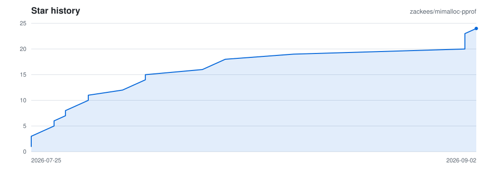
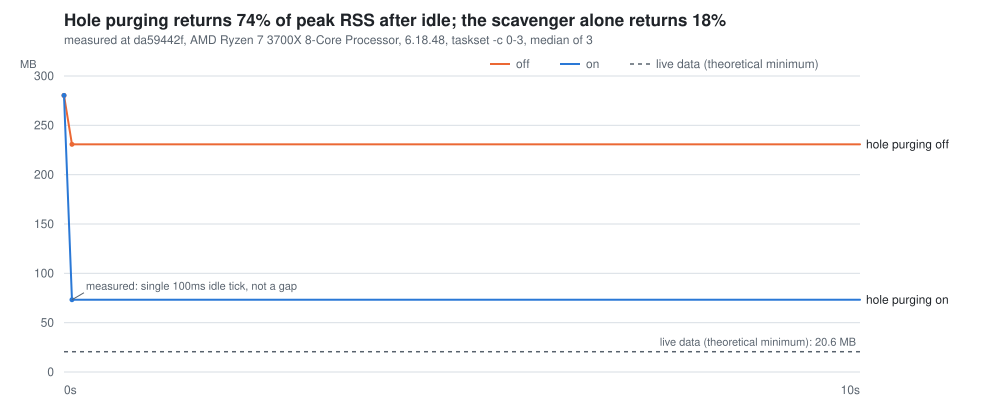
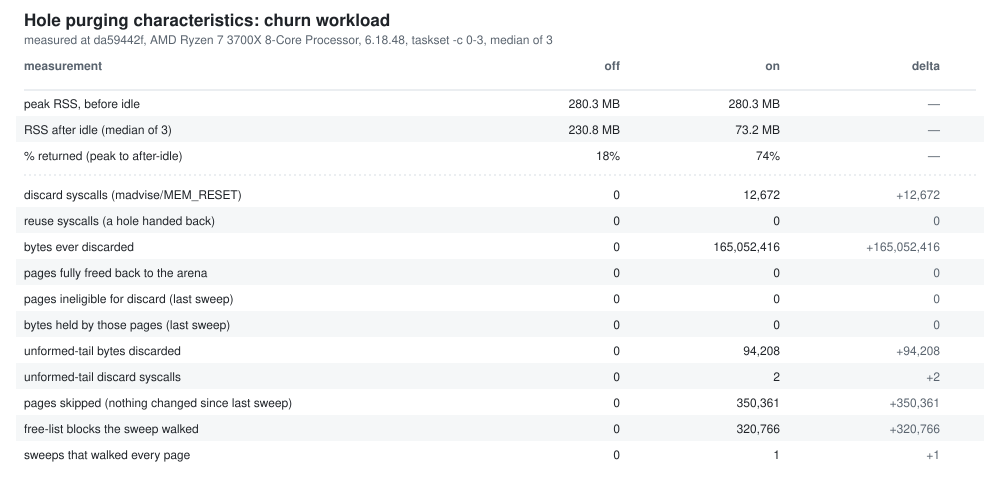

# mimalloc-pprof

> ## mimalloc with native pprof-compatible heap profiling — on Windows, Linux, and macOS alike — and all of Bun's memory-returning features (aka "hole punch") imported and re-verified.

> **The one mimalloc heap profiler that runs natively on Windows.** Upstream mimalloc
> has no profiler at all, and the only other known implementation
> ([Bun's](https://github.com/oven-sh/mimalloc), surveyed in
> [`MIMALLOC_FORKS.md`](MIMALLOC_FORKS.md)) is POSIX-only — its stack capture is guarded
> behind glibc/Apple `<execinfo.h>`.

A fork of [microsoft/mimalloc](https://github.com/microsoft/mimalloc) that adds
**pprof-compatible sampled heap profiling**, with native Windows as a first-class
target alongside Linux and macOS.

```
   __  __ ___ __  __    _    _     _     ___   ____
  |  \/  |_ _|  \/  |  / \  | |   | |   / _ \ / ___|
  | |\/| || || |\/| | / _ \ | |   | |  | | | | |
  | |  | || || |  | |/ ___ \| |___| |__| |_| | |___
  |_|  |_|___|_|  |_/_/   \_\_____|_____\___/ \____|

   ____  ____  ____   ___  _____
  |  _ \|  _ \|  _ \ / _ \|  ___|
  | |_) | |_) | |_) | | | | |_
  |  __/|  __/|  _ <| |_| |  _|
  |_|   |_|   |_| \_\\___/|_|

      PPROF-COMPATIBLE SAMPLED HEAP PROFILING
      WINDOWS FIRST-CLASS | LINUX | MACOS


    malloc / free
          |
          v
          +------------------+
          |     mimalloc     |
          |   [ live heap ]  |
          +---------+--------+
                    |
                    | sampled allocations
                    v
+------------------+      +--------------------------+
|    heap.prof     | ---> |      google/pprof        |
| heap_v2 / proto  |      | flamegraphs | top | diff |
+------------------+      +--------------------------+
```

The allocator tracks sampled live allocations and writes either the gperftools
`heap_v2` text format or an uncompressed pprof `profile.proto`. Both open directly
in [google/pprof](https://github.com/google/pprof) for flame graphs, call graphs,
top reports, and profile diffs.

Profiling is **opt-in at runtime**: a build with `MI_PPROF=ON` (the default) does
not sample until you call a start API or set `MIMALLOC_PROF=1`.

**v3 only.** This fork tracks upstream mimalloc's `dev3` line (crate
[`mimalloc-pprof` 0.9.x](https://crates.io/crates/mimalloc-pprof)). The legacy v2
line (0.8.x, upstream `main`) is preserved on the
[`v2`](https://github.com/zackees/mimalloc-pprof/tree/v2) branch but is not
maintained going forward. Upstream mimalloc v3 (`dev3`) is itself still a
pre-release branch with less field exposure than v2 — see
[how v3 was validated](docs/fork-divergence.md#how-v3-was-validated) for exactly
what that risk means and what was measured.

<picture>
  <source media="(prefers-color-scheme: dark)" srcset=".github/assets/star-history-dark.svg" />
  <source media="(prefers-color-scheme: light)" srcset=".github/assets/star-history-light.svg" />
  
</picture>

**Contents**

- [At a glance](#at-a-glance--why-use-this-version) — what you get over upstream mimalloc, in one screen
- [Integration](#integration) — pprof, exact stats and DHAT in Rust and C, plus the full API table
- [Performance](#performance) — continuous benchmarks vs. upstream mimalloc, Bun's fork, TCMalloc, and jemalloc
- [Why use this fork](#why-use-this-fork) — the most tested mimalloc fork in existence
- [Bun features](#bun-features) — every feature ported from oven-sh/mimalloc, including a measured hole-purging chart
- [Profiling and observability](#profiling-and-observability) — sampled pprof, exact stats, DHAT, memory events
- [Upstream bugs found and fixed](#upstream-bugs-found-and-fixed) — including two unbounded memory leaks
- [Q&A](#qa) — why fork from Microsoft and not from Bun, and other questions people ask
- [Documentation](#documentation) — the full docs index
- [Release history](#release-history)
- [Prior art and credits](#prior-art-and-credits)

---

## At a glance — why use this version?

Upstream mimalloc v3, plus everything below. Every item is on `main`, tested on every
commit, and reachable from both C and Rust ([full API table](#api-surface)).

### Malloc Stats

- **pprof output.** A sampled heap profiler built into the allocator: `MIMALLOC_PROF=1`
  or `mi_prof_start()` / `prof::start()`, dump `heap_v2` text or `profile.proto`, open in
  `pprof` or any flame-graph tool. Sampling costs nothing on the fast path when it is
  off — the `malloc` hot path disassembles byte-identical to an `MI_PPROF=OFF` build —
  and ~512 KiB sampling intervals keep it cheap when it is on. Windows-native
  (MSVC and MinGW), Linux, macOS. → [pprof](#pprof-sampled-heap-profiling)
- **malloc stats.** Exact allocator statistics (`mi_stats_get`, `mi_stats_get_json`,
  `stats::get()`), per sub-process and per heap, embedded as `#` comment lines in every
  profile dump so a sampled profile can be checked against ground truth. Upstream v3's
  API, bound completely in Rust here. → [Exact allocator stats](#exact-allocator-stats)
- **DHAT total accounting.** Exact, every-allocation profiling with lifetimes and
  access counts (`mi_dhat_start`, `dhat::start()`), dumped in Valgrind's DHAT format for
  `dh_view.html`. Independent of `MI_PPROF`. → [DHAT](#dhat-exact-heap-profiling)
- **Memory-events API.** Opt-in allocation-change callbacks and live-allocation
  snapshots (`mi_memory_set_callbacks`, `memory_events::snapshot()`) for your own
  counters — one relaxed flag check per operation while off, available even with the
  profiler compiled out. → [memory events](docs/dhat-and-memory-events.md#memory-events-api)

### Bun's mimalloc improvements

**All of Bun's mimalloc enhancements**, ported from
[oven-sh/mimalloc](https://github.com/oven-sh/mimalloc) through `b20b60d9` and
re-verified under this tree's stress suite. → [Bun features](#bun-features)

- **"Hole punch" memory return.** Free blocks *inside* a still-used page are
  discarded to the OS one page at a time, so a single long-lived object no longer
  pins a 64 KiB–512 KiB page resident. On the churn benchmark it returns **74 % of
  peak RSS** after idle, versus 18 % for the scavenger alone
  (`mi_on_thread_idle()`, `MIMALLOC_PURGE_HOLES`). → [measured](#hole-purging-measured)
- **Background scavenger.** A demand-driven thread purges scheduled arena memory on a
  100 ms timer instead of waiting for the next allocation; threads with an event loop
  can hand the work off with `mi_on_thread_idle_start()` / `park_while_idle()`.
- **`fork()` safety.** `pthread_atfork` handlers with a documented lock order and an
  `MI_DEBUG>2` runtime lock-order checker, so a forked child never inherits a lock
  another thread held.
- **Heap teardown protocol.** A four-step claim protocol closes an ABA race between
  `mi_heap_destroy` and a concurrent allocation, plus Bun's heap-teardown test corpus
  and fault-injection hook; two further use-after-free classes were found and fixed
  here.
- **Lazy abandoned-page bitmaps and unmapped abandon on release.** Per-bin abandoned
  bitmaps are allocated on first use instead of eagerly (~110 KB and ~50 page faults
  saved per heap), and a heap being released abandons its pages without mapping them.
- **Collect on sub-process-safe free.** `mi_heap_destroy` no longer strands ~170 KB
  per destroyed heap in burst patterns.
- **`mi_heap_dump_json` / `mi_heap_get_seq`**, `MI_NO_PROCESS_DETACH` for embedders
  that own teardown, zero-cost-when-off profiler fast path, TLS-slot zeroing, the
  glibc 2.44 `free(NULL)`-before-init fix, Windows PRNG/RAM-sizing/NUMA fixes, and
  macOS TLS slots 96/97.

### Testing / Cross Compilation

- **The most tested mimalloc fork.** Ubuntu, Windows MSVC, Windows MinGW and macOS
  (cross-built on Linux, executed in a macOS guest — no Apple hardware) in Debug and
  Release, profiler in and out, ASan, fuzzing, a memory-regression gate, and a positive
  control for every gate that can carry one. → [Why use this fork](#why-use-this-fork)
- **Upstream bugs found and fixed here first**, including two unbounded memory leaks
  and an ARM64 atomics incompatibility, several since upstreamed by Microsoft.
  → [Upstream bugs](#upstream-bugs-found-and-fixed)
- **A Rust crate with full parity.** `mimalloc-pprof` on crates.io binds every fork C
  export and every `mi_option_t` enumerator, with layout and enum-value checks against
  the C compiler on every build. → [API surface](#api-surface)

---

## Integration

Three instruments, each shown in Rust and C: **pprof** sampled profiling for
production, **exact allocator stats** to check a sampled profile against, and
**DHAT** exact profiling for focused investigations.

In a hurry, or looking for one specific call? [**API surface**](#api-surface) below
is the whole thing in one table — every C entry point, its raw Rust FFI declaration,
and its safe Rust wrapper.

### pprof: sampled heap profiling

#### Rust

```toml
[dependencies]
mimalloc-pprof = "0.9"

[profile.release]
debug = "line-tables-only"
strip = false
```

```rust
use mimalloc_pprof::{prof, MiMalloc};
use std::path::Path;

#[global_allocator]
static ALLOCATOR: MiMalloc = MiMalloc;

fn main() -> std::io::Result<()> {
    assert!(prof::start(0), "profiler already running"); // 0 = default, ~512 KiB

    let retained = vec![0_u8; 1024 * 1024];
    prof::dump_file(Path::new("heap.prof"))?;            // dump while still live
    std::hint::black_box(&retained);

    prof::stop();
    Ok(())
}
```

#### C

```sh
cmake -S . -B build -DMI_PPROF=ON -DCMAKE_BUILD_TYPE=RelWithDebInfo
cmake --build build --config RelWithDebInfo
```

`MI_PPROF` now defaults to `1` in the header (`include/mimalloc/types.h`), so a
build that compiles `src/static.c` directly instead of using CMake gets the
profiler by default too — CMake keeps passing `-DMI_PPROF=0/1` explicitly, which
still wins over the header default. On non-Windows you still need to pass
`-fno-omit-frame-pointer` yourself in that case — without it the profiler's stack
capture is unreliable.

```c
#include <mimalloc.h>
#include <mimalloc/profile.h>

int main(void) {
  if (!mi_prof_start(0)) return 1;          /* 0 = default interval, ~512 KiB */

  void* p = mi_malloc(1024 * 1024);
  if (!mi_prof_dump("heap.prof")) return 2; /* dump while it is still live */

  mi_free(p);
  mi_prof_stop();
  return 0;
}
```

`mi_prof_start` and `mi_prof_dump` are `nodiscard` — check their results or the
compiler will warn.

#### Or without touching the code at all

```sh
MIMALLOC_PROF=1 MIMALLOC_PROF_DUMP_AT_EXIT=heap.prof ./my_app
```

Built with `MI_NO_PROCESS_DETACH` (issue #268)? The automatic exit path that
`*_DUMP_AT_EXIT` relies on is skipped by design — call `mi_prof_dump` / `mi_dhat_dump`
yourself before the process exits.

#### Then read the profile

```sh
pprof -http=:0 ./my_app heap.prof     # interactive
pprof -top ./my_app heap.prof         # text summary
```

#### ⚠️ The flags your stacks depend on

On Linux/macOS the profiler walks frame pointers, and **your** code must keep
them — the failure mode is silently truncated stacks, not an error:

| Toolchain | Required flag |
|---|---|
| C / C++ | `-fno-omit-frame-pointer` |
| Rust | `-Cforce-frame-pointers=yes` (in `.cargo/config.toml` rustflags) |

Apply it to every library you want to see in a profile, and build with debug
info so addresses resolve to names. Windows x64 needs no flag — it uses unwind
tables — but keep the matching **PDB** next to the binary.

### Exact allocator stats

Alongside the sampled profile, v3 exposes the allocator's own **exact** counters
— useful for checking how much the sampled numbers under-count.

#### Rust

```rust
let s = mimalloc_pprof::prof::stats();
println!(
    "sampled live: {} bytes; exact committed: {}, requested: {}",
    s.live_bytes, s.heap.committed, s.heap.malloc_requested,
);
```

#### C

```c
#include <stdio.h>
#include <mimalloc.h>
#include <mimalloc/profile.h>

mi_prof_stats_t_decl(stats);   /* zeroed, with size + version filled in */
if (mi_prof_stats_get(&stats)) {
  printf("sampled live: %zu bytes; exact committed: %zu, requested: %zu\n",
         stats.live_bytes, stats.heap_committed, stats.heap_malloc_requested);
}
```

Every text dump also embeds the same counters as pprof-ignored `#` comment lines,
so a saved profile carries them without any code at all.

One caveat: `malloc_requested` is only maintained when the library was built with
`-DMI_STAT=2` — a default release build reports 0. Since 0 is also a legitimate
value, check `heap.detailed` (Rust) / `stats.heap_stats_detailed` (C) to tell the
two apart. Full field list and the rest of the caveats:
**[docs/profiler.md → allocator statistics](docs/profiler.md#allocator-statistics-in-the-profile-v3-only)**.

### DHAT: exact heap profiling

When sampling isn't enough — you want **every** allocation's size and lifetime —
run a short, focused session under the exact DHAT observer and open the result
in Valgrind's [`dh_view.html`](https://valgrind.org/docs/manual/dh-manual.html).
No code needed at all:

```sh
MIMALLOC_DHAT=1 MIMALLOC_DHAT_DUMP_AT_EXIT=heap.dhat.json ./my_app
```

Built with `MI_NO_PROCESS_DETACH` (issue #268)? The automatic exit path that
`*_DUMP_AT_EXIT` relies on is skipped by design — call `mi_prof_dump` / `mi_dhat_dump`
yourself before the process exits.

#### Rust

```rust
use mimalloc_pprof::dhat;
use std::path::Path;

assert!(dhat::start(), "DHAT already running");

let retained = vec![0_u8; 1024 * 1024];
std::hint::black_box(&retained);

dhat::stop();  // stop observing; the retained records still dump
dhat::dump_file(Path::new("heap.dhat.json")).expect("write DHAT report");
```

#### C

```c
#include <mimalloc.h>
#include <mimalloc/dhat.h>

if (!mi_dhat_start()) return 1;

void* p = mi_malloc(4096);
mi_free(p);

mi_dhat_stop();                             /* stop observing; report still dumps */
if (!mi_dhat_dump("heap.dhat.json")) return 2;
```

Unlike the sampled profiler this keeps a record for **every** live allocation, so
it is exact but high-overhead — use it for tests and focused investigations, not a
continuously running production workload. Memory budgeting
(`MIMALLOC_DHAT_MAX_BYTES`), partial-report semantics, and the stats API:
**[docs/dhat-and-memory-events.md](docs/dhat-and-memory-events.md)**.

### Returning memory when a thread goes idle

A background **scavenger** thread returns freed arena memory to the OS on a timer
instead of waiting for the next allocation to run a purge — so an idle process
stops sitting on memory it no longer uses. It starts on demand (the first time a
second thread appears, or the first park) and is controlled by
`MIMALLOC_SCAVENGER` (`mi_option_scavenger`, default `1`) together with
`MIMALLOC_PURGE_DELAY`; `mi_scavenger_stop()` stops it for good.

An event loop that knows it is about to block can say so and get the work done for
free, on the scavenger, while it sits in the kernel:

```c
#include <mimalloc.h>

mi_on_thread_idle();               /* do the idle work here, on this thread */

if (mi_on_thread_idle_start()) {   /* ... or hand it to the scavenger instead */
  /* block in the kernel here (epoll_wait, WaitForMultipleObjects, ...);
     this thread must not allocate or free until `_end` */
  mi_on_thread_idle_end();
}
```

`mi_on_thread_idle_start` returns `false` when there was nothing to hand off, and
then `mi_on_thread_idle_end` is not required. Between the two calls the thread must
not allocate or free — that is the whole precondition the sweep relies on.

The scavenger is stopped and joined at process exit. On Windows that happens from an
`atexit` handler, so it holds even in an `MI_NO_PROCESS_DETACH` build; on POSIX such a
build leaves it running through `exit()` unless you call `mi_scavenger_stop()` yourself.

That idle sweep also punches **holes**: upstream mimalloc gives a page back only once
*every* block in it is free, so a single long-lived object keeps a whole 64 KiB/512 KiB
page resident. Hole purging discards the memory of the free blocks inside such a page,
one OS page at a time, without changing its commit state — on a churn workload with
scattered survivors that halves peak RSS. It is on by default
(`MIMALLOC_PURGE_HOLES`, `mi_option_purge_holes`), costs the alloc/free fast path
nothing, and reports what it got back:

```c
#include <mimalloc.h>

mi_purge_holes_stats_t h;
mi_purge_holes_stats_get(&h);   /* discarded bytes/blocks now, totals, syscalls, ... */
mi_purge_holes_report();        /* per size class: what could NOT be discarded, and why */
```

For a measured chart of what this buys on a churn workload, see
[Bun features: hole purging, measured](#hole-purging-measured).

### API surface

Every API this fork adds, in all three places it can be reached from: the C header,
the crate's raw FFI module (`mimalloc_pprof::sys`, `unsafe`), and the crate's safe
wrapper. There are no gaps — `ci/check_rust_surface.py` fails the build if a **fork** C export
or an `mi_option_t` enumerator appears without a binding (upstream's own exports are
bound opportunistically, not by requirement), and
`rust/mimalloc-pprof/tests/t19_layout.rs` checks every mirrored struct layout and
option value against what the C compiler actually laid out.

Where the third column says **sys only**, that is deliberate and the reason is
recorded in `ci/check_rust_surface.py`'s allowlist.

#### Sampled pprof profiler — `include/mimalloc/profile.h`

| C | Rust FFI (`sys::`) | Rust safe wrapper |
|---|---|---|
| `mi_prof_start` | ✅ | `prof::start` |
| `mi_prof_start_seeded` | ✅ | `prof::start_seeded` |
| `mi_prof_start_ex`, `mi_prof_config_t` | ✅ | `enable_heap_profiling_with(&ProfConfig)` |
| `mi_prof_stop` | ✅ | `prof::stop` |
| `mi_prof_is_enabled` | ✅ | `prof::is_enabled` |
| `mi_prof_reset` | ✅ | `prof::reset` |
| `mi_prof_dump` | ✅ | `prof::dump_file` |
| `mi_prof_dump_writer` | ✅ | `prof::dump_to_vec` |
| `mi_prof_dump_proto` | ✅ | `prof::dump_proto_file` |
| `mi_prof_dump_proto_writer` | ✅ | `prof::dump_proto_to_vec` |
| `mi_prof_stats_get`, `mi_prof_stats_t` | ✅ | `prof::stats() -> ProfStats` |
| `mi_prof_snapshot_new` / `_visit` / `_free` | ✅ | `prof::samples() -> Vec<Sample>` |
| `mi_prof_modules_visit` | ✅ | `prof::modules() -> Vec<ModuleInfo>` |
| `mi_prof_visit` | ✅ | **sys only** — its visitor runs under the profiler lock, where an allocating Rust closure can deadlock; `prof::samples` takes a snapshot first |
| `mi_prof_debug_stats` | ✅ | **sys only** — deprecated in favour of `mi_prof_stats_get` |
| _no-code_: `MIMALLOC_PROF`, `MIMALLOC_PROF_DUMP_AT_EXIT`, … | — | see [options](#options--mi_option_t) below |

Compiled out with the crate's `default-features = false` (mirrors `#if MI_PPROF`); the
Rust API stays present and `prof::start` returns `false`.

#### DHAT exact profiling — `include/mimalloc/dhat.h`

| C | Rust FFI (`sys::`) | Rust safe wrapper |
|---|---|---|
| `mi_dhat_start` | ✅ | `dhat::start` |
| `mi_dhat_stop` | ✅ | `dhat::stop` |
| `mi_dhat_is_enabled` | ✅ | `dhat::is_enabled` |
| `mi_dhat_stats_get`, `mi_dhat_stats_t` | ✅ | `dhat::stats() -> dhat::Stats` |
| `mi_dhat_dump` | ✅ | `dhat::dump_file` |

Independent of `MI_PPROF`: available in both feature modes.

#### Memory events — `include/mimalloc/memory-events.h`

| C | Rust FFI (`sys::`) | Rust safe wrapper |
|---|---|---|
| `mi_memory_tracking_set_enabled` | ✅ | `memory_events::set_enabled` |
| `mi_memory_tracking_is_enabled` | ✅ | `memory_events::is_enabled` |
| `mi_memory_snapshot`, `mi_memory_snapshot_t` | ✅ | `memory_events::snapshot() -> Snapshot` |
| `mi_memory_set_callbacks`, `mi_memory_callbacks_t`, `mi_memory_change_t` | ✅ | `memory_events::set_callbacks(&'static Callbacks)` / `clear_callbacks` |
| `mi_memory_visit_live_allocations` | ✅ | `unsafe memory_events::visit_live_allocations` |
| `mi_unwrapped_malloc` / `_free` / `_realloc` | ✅ | `unwrapped_malloc` / `unwrapped_free` / `unwrapped_realloc` |

Always compiled in, opt-in at runtime. Off by default, and while it is off every
allocate/free/realloc pays for one relaxed flag check and nothing else.

#### Exact allocator statistics — `include/mimalloc-stats.h`

Upstream's API, not the fork's, but it is what a sampled profile is checked against —
so the crate binds all of it.

| C | Rust FFI (`sys::`) | Rust safe wrapper |
|---|---|---|
| `mi_stats_get`, `mi_stats_t` | ✅ | `stats::get() -> Stats` (derefs to the full struct) |
| `mi_stats_get_json` | ✅ | `stats::json` |
| `mi_stats_as_json` | ✅ | `Stats::to_json` |
| `mi_stats_print_out` | ✅ | `stats::print` |
| `mi_stats_get_bin_size` | ✅ | `stats::bin_size` |
| `mi_subproc_stats_get` | ✅ | `stats::subproc_get` |
| `mi_subproc_stats_get_exclusive` | ✅ | `stats::subproc_get_exclusive` |
| `mi_subproc_stats_get_json` | ✅ | `stats::subproc_json` |
| `mi_subproc_stats_print_out` | ✅ | `stats::subproc_print` |
| `mi_subproc_heap_stats_print_out` | ✅ | `stats::subproc_heap_print` |
| `mi_heap_stats_get` / `_get_json` / `_print_out`, `mi_heap_stats_merge_to_subproc` | ✅ | **sys only** — they take a `mi_heap_t*`, and v3 removed `mi_heap_get_default`, so Rust has no safe way to name a heap |

Note what is **not** in `mi_stats_t`: the idle-sweep and hole-purging gauges. They live
in `mi_purge_holes_stats_t` instead, because the sweep also covers pages no heap owns
and `mi_stats_t` cannot grow (it is embedded in a theap, at the meta-allocator's 8 KB
block limit).

#### Heap dump

| C | Rust FFI (`sys::`) | Rust safe wrapper |
|---|---|---|
| `mi_heap_dump_json` | ✅ | `heap_dump_json(include_blocks, hash_addresses)` |
| `mi_heap_get_seq` | ✅ | **sys only** — needs a `mi_heap_t*` (see above); the seq numbers are already in `heap_dump_json`'s output |

#### Thread idle, scavenger and hole purging

A [Bun feature](#bun-features), ported from `oven-sh/mimalloc` — see that section for
what hole purging buys on a churn workload. There is no single "hole punch" entry point:
the feature is reached through the idle-sweep calls below, the `purge_holes*` options,
and the `mi_purge_holes_stats_t` gauges.

| C | Rust FFI (`sys::`) | Rust safe wrapper |
|---|---|---|
| `mi_on_thread_idle` | ✅ | `on_thread_idle()` |
| `mi_on_thread_idle_start` / `_end` | ✅ | `park_while_idle() -> Option<IdlePark>` (ends on drop) |
| `mi_scavenger_stop` | ✅ | `scavenger_stop()` |
| `mi_purge_holes_stats_get`, `mi_purge_holes_stats_t` | ✅ | `purge_holes_stats() -> MiPurgeHolesStats` |
| `mi_purge_holes_report` | ✅ | `purge_holes_report()` |

#### Options — `mi_option_t`

| C | Rust FFI (`sys::`) | Rust safe wrapper |
|---|---|---|
| `mi_option_t` (61 enumerators; 13 added by this fork at indices 47–59) | `sys::mi_option_*`, `sys::MI_OPTIONS_IN_ORDER` | `options::Opt` (named constants + range-checked `Opt::from_raw`) |
| `mi_option_get` / `_get_clamp` / `_get_size` | ✅ | `options::get` / `get_clamp` / `get_size` |
| `mi_option_set` / `_set_default` | ✅ | `options::set` / `set_default` |
| `mi_option_is_enabled` / `_enable` / `_disable` / `_set_enabled` / `_set_enabled_default` | ✅ | `options::is_enabled` / `enable` / `disable` / `set_enabled` / `set_enabled_default` |
| `mi_options_print_out` | ✅ | `options::print` |

The thirteen this fork adds, each also settable as `MIMALLOC_<NAME>` in the environment:

| Option | Default | What it does |
|---|---|---|
| `prof` | `0` | start the sampled profiler at process start |
| `prof_sample_rate` | `524288` | average bytes between samples |
| `prof_bt_max` | `32` | max captured stack depth |
| `prof_accum` | `0` | keep cumulative counters until `mi_prof_reset` |
| `prof_seed` | `0` | sampling PRNG seed; 0 = nondeterministic |
| `prof_max_bytes` | `0` | budget for profiler-internal arena memory; 0 = unbudgeted |
| `memory_events` | `0` | enable allocation-change accounting/callbacks |
| `purge_zeroes` | `0` | **dead** since #80; the slot is kept so nothing renumbers |
| `scavenger` | `1` | run the background arena-purging thread |
| `purge_holes` | `1` | discard free blocks inside still-used pages on idle |
| `purge_holes_eager_zero` | `0` | zero before discarding, so a mis-scoped discard corrupts visibly |
| `purge_holes_min_interval` | `100` | ms floor between sweeps of one thread's heaps |
| `purge_holes_full_every` | `64` | every N-th sweep walks every page; 0 disables |

Because they are positional, a stale Rust mirror of this enum would silently set the
*wrong* option — which is why `tests/t19_layout.rs` checks every value against the C
compiler and `ci/check_rust_surface.py` checks the whole sequence against the header.

#### Allocation

`MiMalloc` implements `GlobalAlloc`. Beyond that the crate binds `mi_malloc`,
`mi_zalloc`, `mi_calloc`, `mi_realloc`, `mi_free`, their `_aligned` forms,
`mi_usable_size`, `mi_expand`, and the zeroing-realloc family (`mi_rezalloc`,
`mi_recalloc`, and their aligned forms) as `rezalloc` / `recalloc` / `expand` /
`usable_size` — `GlobalAlloc` has no `grow_zeroed`, so without them a Rust caller would
grow and `memset` by hand, redoing work mimalloc has already done.

### Going deeper

Everything deeper — CMake install and linking, the zeroing-realloc family,
stack-flag guidance, cross-compilation — is in
**[docs/c-integration.md](docs/c-integration.md)** and
**[docs/rust-integration.md](docs/rust-integration.md)**. The full instrument
lineup, including the memory-events API, is in
[Profiling and observability](#profiling-and-observability).

---

## Performance

mimalloc-pprof is continuously benchmarked against **upstream mimalloc**,
**Bun's mimalloc fork** ([`oven-sh/mimalloc`](https://github.com/oven-sh/mimalloc)),
**TCMalloc**, and **jemalloc** on a dedicated Linux x86-64 runner. Every result
is **GitHub-hosted and informational** — no self-hosted hardware, no hand-picked
runs, no unpublished baselines.

| Resource | Description |
|---|---|
| [**Benchmark dashboard**](https://zackees.github.io/mimalloc-pprof/) | Live per-scenario throughput, paired statistical effects, and full allocator provenance |
| [`benchmark-stats` branch](https://github.com/zackees/mimalloc-pprof/tree/benchmark-stats) | Raw sealed site artifacts (history, manifests, digests) |
| [`latest.json`](https://zackees.github.io/mimalloc-pprof/latest.json) | Machine-readable publication envelope for the most recent headline run |

In brief: all five allocators are pinned to immutable, SHA-256-verified sources;
every block runs them in randomized order under one workload seed; paired effects
are bootstrap confidence intervals at 95%, expressed relative to upstream
mimalloc; and profiling is disabled during measurement so the allocator runs in
its natural configuration.

The Bun row is `oven-sh/mimalloc` at `b20b60d9` — the exact tree this fork's
Bun-parity work has ported from — built by the same cmake recipe as the upstream
and fork rows, so the three mimalloc lines differ only in their source. That pin
moves in the same PR as each future Bun-parity ingest. Charts below are
regenerated by the scheduled dashboard run; a freshly added row appears there
first.

### Thread scaling by allocation pattern

Aggregate throughput as worker threads go from 1 to 4 to 16, for four allocation
patterns. Each pattern is a seeded random operation stream, so all five
allocators replay one identical stream inside each paired block.

> **Coverage mode: reduced statistical rigor (3 blocks per cell).** These panels
> trade statistical rigor for thread coverage — no confidence intervals, no noise
> gating; read them for shape. The runner allows 4 logical CPUs, so the 16-thread
> point is 4× oversubscribed and describes contention, not core scaling — it is
> shaded on every chart.

[](https://zackees.github.io/mimalloc-pprof/#scaling)

[](https://zackees.github.io/mimalloc-pprof/#scaling)

[](https://zackees.github.io/mimalloc-pprof/#scaling)

[](https://zackees.github.io/mimalloc-pprof/#scaling)

| Pattern | Sizes | What it stresses |
|---|---|---|
| Tiny hot path | 16–64 B | small-object fast path, high alloc/free rate, small live set |
| General mix | 8 B–4 KiB log-uniform | everyday mix including realloc, medium live set |
| Large buffers | 64 KiB–4 MiB | large allocations with one-byte-per-page touching |
| Cross-thread handoff | 16–512 B | remote-free pressure; blocks are freed by another worker |

Full methodology, per-cell tables, and the pending metric roadmap:
**[docs/benchmarks.md](docs/benchmarks.md)**.

---

## Why use this fork

Beyond being the one mimalloc with a native-Windows heap profiler, this is — as of
September 2026 — **the most tested mimalloc fork in existence**, and that testing
regime has caught real allocator bugs that **Microsoft has since upstreamed fixes
for** ([`60c4f031`](https://github.com/microsoft/mimalloc/commit/60c4f031c9d878da05ffa6066777accd51458b98),
crediting [#56](https://github.com/zackees/mimalloc-pprof/issues/56)).

**Every platform, every commit.** Ubuntu, Windows **MSVC**, Windows **MinGW**, and
macOS are all required CI gates, in Debug and Release, with the profiler compiled
in and out, plus shared-library builds. Upstream has no MinGW job at all — running
one here is exactly how two unbounded memory leaks were found
([docs/upstream-bugs.md](docs/upstream-bugs.md)).

**Cross-compilation is tested, not assumed.** The Rust crate builds wherever
`cc-rs` reaches a C compiler, and CI exercises cross builds including
`cargo-xwin` for `aarch64-pc-windows-msvc` — which is how a real upstream
ARM64-atomics incompatibility was caught and fixed
([#223](https://github.com/zackees/mimalloc-pprof/issues/223)).

**Tests that must prove they can fail.** Beyond correctness suites there is a
memory-regression gate, an instruction-set baseline scanner, AddressSanitizer,
and structured fuzzing — and every gate that can carry a *positive control* has
one: a deliberately injected bug it must catch, verified on every run. A
regression test that has never been observed to fail proves nothing
([docs/ci-gates.md](docs/ci-gates.md)).

**The entire fork constellation was scoured for improvements.** All 1,146 GitHub
forks of mimalloc were enumerated and the living ones byte-diffed — every fork
pushed since mid-2024 plus every older starred one — and each real change rated
for adoption ([`MIMALLOC_FORKS.md`](MIMALLOC_FORKS.md)). The good ideas came in:
[Bun's](https://github.com/oven-sh/mimalloc) zero-tracking optimization and its
TLS-slot zeroing fix are on `main` — in the latter case each fork had found half
the bug, and this one now carries both halves. Just as deliberately, changes that
failed review stayed out, each with its reasoning recorded
([docs/fork-divergence.md](docs/fork-divergence.md)).

**Measured against its peers, continuously.** Throughput is benchmarked against
upstream mimalloc, Bun's fork, TCMalloc, and jemalloc on every publication cycle,
with sealed artifacts and reproduction commands — the charts above.

**Committed to for the long term.** [Zach Vorhies](https://github.com/zackees),
the author, commits to maintaining this fork long-term.
[Pull requests](https://github.com/zackees/mimalloc-pprof/pulls) are welcome and
will be reviewed — and held to the same bar as everything else here: every
contribution passes the full four-platform CI matrix and its gates before it
lands, so quality is maintained by machinery, not just intent.

---

## Bun features

The largest source of features in this fork is not original work: **[oven-sh/mimalloc](https://github.com/oven-sh/mimalloc)**,
Bun's mimalloc fork (MIT), ingested through [`b20b60d9`](https://github.com/oven-sh/mimalloc/commit/b20b60d9), has independently
solved several of the same problems — a background scavenger, hole purging, fork safety, heap-teardown races, profiler
test coverage. Where its solution held up under this tree's own stress suite, it was ported rather than reinvented. The
full survey, including what was *not* imported and why, is in [`MIMALLOC_FORKS.md`](MIMALLOC_FORKS.md).

| Feature | What it does | Bun source | Landed in | Notes / deviations |
|---|---|---|---|---|
| TLS-slot zeroing after slot-array growth | Zeroes newly-grown thread-local slot-array entries so a stale, uninitialized slot can never be returned as a `mi_theap_t*`. | [`afb41757`](https://github.com/oven-sh/mimalloc/commit/afb41757) | [#148](https://github.com/zackees/mimalloc-pprof/pull/148) | Symmetry fix: this tree had separately fixed the same function's pointer-*provenance* bug; each fork carried only half the fix until this import. |
| Adversarial profiler test cases | Two adversarial profiler tests: aligned allocations (interior-pointer resolution) and empty-profile dumps. | `test/test-prof-adversarial.c` (`942b8342`) | [#51](https://github.com/zackees/mimalloc-pprof/pull/51) | Found via a survey of other mimalloc v3 profiler forks (issue #50). Two of Bun's cases imported so far; more remain (rated 5 in `MIMALLOC_FORKS.md`). |
| Zero-tracking idea (`zalloc` skips `memset` after a zero-purge) | Tracks when a purge left a range reading back zero so `mi_zalloc` can skip its `memset`. | Bun's fork (idea; rated 4/5 in `MIMALLOC_FORKS.md`) | [#79](https://github.com/zackees/mimalloc-pprof/pull/79) | Reimplemented earlier, behind `mi_option_purge_zeroes`. Lost in the v3 pin bump and never restored (issue #80); `mi_option_purge_zeroes` / `MIMALLOC_PURGE_ZEROES` is now a dead, no-op option slot — kept, never renumbered, so existing configs don't break. |
| glibc 2.44 `free(NULL)`-before-init page-map fix | The 2-level page map's initial submap-0 entry is `NULL`; the release/unchecked lookup indexed it without a NULL check, so glibc 2.44's loader-time `free(NULL)` (before any constructor runs) faulted at address 0. | [`7ac561ab`](https://github.com/oven-sh/mimalloc/commit/7ac561ab) | [#276](https://github.com/zackees/mimalloc-pprof/pull/276) | Landed together with the overlay pin bump to `6def7be9` that introduced upstream's 2-level page-map rewrite (this bug did not exist at the previous pin). |
| Zero-cost-when-off profiler fast path (`prof_force_slow`) | Poisons `pages_free_direct` while profiling runs so `mi_malloc`'s fast path disassembles byte-identical whether `MI_PPROF` is on or off with the profiler stopped. | `942b8342` (strategy import) | [#281](https://github.com/zackees/mimalloc-pprof/pull/281) | Own functions adapted to this tree's `mi_theap_t`/`mi_subproc_t` layout rather than Bun's page-flag-bit mechanism. Fixed a +70% ns/alloc regression. |
| `MI_NO_PROCESS_DETACH` | Opt out of the exit-time destructor entirely, for embedders that own their own teardown. | Bun (unconditional) | [#284](https://github.com/zackees/mimalloc-pprof/pull/284) | ~5-line port: a CMake option, an early return in `_mi_auto_process_done`, a guarded destructor registration. `MIMALLOC_PROF_DUMP_AT_EXIT` / DHAT dump-at-exit are consequently also skipped under the define. |
| `mi_heap_dump_json` / `mi_heap_get_seq` + stats snapshot printing | JSON heap dump API, and printing `_mi_stats_print` from a snapshot (`mi_stats_add`) instead of the live, concurrently-updated struct. | `942b8342` | [#286](https://github.com/zackees/mimalloc-pprof/pull/286) | `mi_heap_t::heap_seq` already existed at this tree's pin; only the accessor and the dump walk (`src/heap-dump.c`) were new. |
| `pthread_atfork` fork-safety handlers | Prepare/parent/child handlers so a `fork()`ing process doesn't inherit a lock held by another thread. | Bun (`_mi_process_fork_prepare/parent/child`) | [#289](https://github.com/zackees/mimalloc-pprof/pull/289) | The lock **skeleton** is Bun's; the lock **order** is not — re-derived from this tree's actual lock-nesting graph and documented edge-by-edge in `src/fork.c`, with an owner-tid + mutex-depth `MI_DEBUG>2` runtime detector that asserts every acquire agrees with the documented order. |
| Heap delete/destroy teardown protocol | Four-step claim protocol closing an ABA race between `mi_heap_destroy` and a concurrent allocation on the same heap. | Bun (`src/theap.c`, `src/heap.c`, `src/arena.c`) | [#291](https://github.com/zackees/mimalloc-pprof/pull/291) | Adapted for the absence of `pthread_atfork`/scavenger state at the time. Also imported Bun's heap-teardown test corpus (`test-heap-teardown.c`, `test-heap-churn.c`, `test-heap-aba.c`) and its `mi_debug_fail_os_commit_after` fault-injection hook. Found and fixed two use-after-free classes the working protocol made reachable, beyond what Bun's own tree has. |
| Background scavenger thread + `mi_on_thread_idle*` | A demand-driven background thread that purges scheduled arena memory on a timer instead of only on allocation; `purge_delay` 1000 → 100 ms. | `src/scavenger.c` | [#299](https://github.com/zackees/mimalloc-pprof/pull/299) | Deviations from Bun: stopped from an `atexit` handler on Windows; lazy start fires only from a main-subprocess thread (a sub-subprocess-started scavenger has its TLS torn down first); the new `mi_subproc_t` fields are appended at the struct tail rather than mid-struct — Bun's placement shifts `stats`, which the free path touches, ~2 ns/alloc+free. (The park protocol itself is Bun's, imported as part of this PR.) |
| Page hole purging (`purge_holes*`) | Discards the memory of free blocks *inside* a still-used page (OS-page units), so one long-lived object no longer pins a whole page resident. | `src/page.c` (+1038), `942b8342` | [#302](https://github.com/zackees/mimalloc-pprof/pull/302) | The whole engine, including the sweep drivers, was moved into a new `src/page-holes.c`; upstream files carry only five hook calls. See "Hole purging, measured" below. |
| Windows PRNG / RAM-sizing / NUMA fixes; macOS TLS slots 96/97 | `ProcessPrng` instead of always loading `bcrypt.dll`; `GlobalMemoryStatusEx` instead of an SMBIOS parse; NUMA node count off-by-one; fixed TLS slots moved into libpthread's never-assigned gap (95 is the last assigned key). | Bun (`6ccccec2`, `c3c36aa8`, `75a1edf8`, `d676cced`, `include/mimalloc/prim-tls.h:356-361`); NUMA fix from upstream `66383f06`, cherry-picked by Bun as `16cd3684` | [#297](https://github.com/zackees/mimalloc-pprof/pull/297) | CI fetches `apple-oss-distributions/libpthread`'s `tsd_private.h` from `main` (not pinned) and fails if slot 96 or 97 is ever assigned upstream. |
| Collect on sub-process-safe free | `_mi_free_subproc_safe` collects the page inside its own sub-process, so `mi_heap_destroy` no longer strands ~170 KB per destroyed heap in burst patterns. | [`04ced98d`](https://github.com/oven-sh/mimalloc/commit/04ced98d) | [#318](https://github.com/zackees/mimalloc-pprof/pull/318) | Hand-ported (trees diverged); converged on Bun's `MI_THREADID_DETACHED` test in `mi_stat_free` after review found a teardown-order NULL deref in the first draft. New `test-heap-burst-destroy` proves RED/GREEN. |
| Lazy per-bin abandoned bitmaps, `heap->releasing`, unmapped abandon on release | Per-bin abandoned-page bitmaps are allocated on first abandon instead of eagerly (~110 KB and ~50 page faults per heap); a heap being released abandons its pages unmapped; the delete walk is ordered against concurrent frees. | [`787be2a8`](https://github.com/oven-sh/mimalloc/commit/787be2a8), [`91218f30`](https://github.com/oven-sh/mimalloc/commit/91218f30), [`a26c5de7`](https://github.com/oven-sh/mimalloc/commit/a26c5de7) | [#319](https://github.com/zackees/mimalloc-pprof/pull/319) | Review found the lazy allocation could re-enter `subproc->theap_meta_lock` from the abandon path; sub-process meta theaps now have `allow_page_abandon=false` like the process one, and meta pages skip the bitmap allocation. New tests `test-abandoned-lazy`, `test-heap-release-mt`. |

### Hole purging, measured

A background **scavenger** thread returns freed arena memory to the OS on a timer
instead of waiting for the next allocation to trigger a purge, so an idle process
stops sitting on memory it no longer needs (`MIMALLOC_SCAVENGER`, default on;
`MIMALLOC_PURGE_DELAY` is 100 ms in this fork, upstream is 1000). Embedders with an
event loop can call `mi_on_thread_idle()` right before blocking in the kernel to get
that work done for free on the calling thread.

The same idle point also punches **holes**: upstream mimalloc returns a page to the
OS only once *every* block in it is free, so one long-lived object keeps a whole
64 KiB/512 KiB page resident. Hole purging discards the free blocks *inside* a
still-used page instead, one OS page at a time, via `MADV_DONTNEED` /
`MADV_FREE_REUSABLE` / `MEM_RESET` — commit state is never touched, and the free
list is rebuilt before anything is discarded. It costs the malloc/free fast path
nothing (default on, `MIMALLOC_PURGE_HOLES`; pacing via
`MIMALLOC_PURGE_HOLES_MIN_INTERVAL`, default 100 ms; `MIMALLOC_PURGE_HOLES_EAGER_ZERO`
is a test knob, always on when `MI_DEBUG>1`, that zeroes a range before discarding it
so a mis-scoped discard corrupts visibly rather than silently). Query it live with
`mi_purge_holes_stats_get` / `mi_purge_holes_report`. **The scavenger is on in both
runs of the chart below; the chart isolates hole purging's own contribution.**

<picture>
  <source media="(prefers-color-scheme: dark)" srcset=".github/assets/hole-purging-rss-dark.svg" />
  <source media="(prefers-color-scheme: light)" srcset=".github/assets/hole-purging-rss-light.svg" />
  
</picture>

<picture>
  <source media="(prefers-color-scheme: dark)" srcset=".github/assets/hole-purging-table-dark.svg" />
  <source media="(prefers-color-scheme: light)" srcset=".github/assets/hole-purging-table-light.svg" />
  
</picture>

Both were measured at commit `be13eadf` with
[`ci/bench_hole_purging.py`](ci/bench_hole_purging.py): 150k 512 B + 100k 1 KiB +
50k 2 KiB blocks, a scattered 1-in-20 kept alive, then idled for 10 s calling
`mi_on_thread_idle()` every 100 ms — median of 3 runs, pinned to 4 CPUs. The table's
size-class breakdown, `discardable-vs-OS-page-size` curve and per-run text report are
in [`.github/assets/hole-purging-report.json`](.github/assets/hole-purging-report.json);
some counters `mi_purge_holes_stats_t` does not expose (a sweep count split by
owner vs. scavenger thread, why-ineligible buckets, `min_interval` pacing skips) are
not in the table because there is nothing to read them from. Regenerate both with:

```sh
uv run ci/bench_hole_purging.py --build-dir <build> --include-dir include --out-dir .github/assets
uv run ci/bench_hole_purging.py --build-dir <build> --include-dir include --out-dir .github/assets --table
```

For comparison, the PR #302 description measured Bun's own workload shape
(400k blocks, min of 5 runs): peak RSS went **210.0 MB → 105.0 MB**, and
single-threaded alloc/free latency was unchanged within noise across three
independent rounds (the free path gains no new code in a release build — the only
addition sits inside the `MI_CHECK_DOUBLE_FREE` path, debug/secure builds only). The
one real cost is `sizeof(mi_page_t)` growing 144 → 192 bytes, all of it appended at
the tail.

The engine, including the sweep drivers, is `src/page-holes.c`, invoked from
the idle sweep in `src/scavenger.c` (`src/page.c` and `src/theap.c` carry only a
handful of hook calls). More detail, including the options reference, is in
[docs/c-integration.md](docs/c-integration.md#scavenger-and-hole-purging).

### Not imported (yet)

- **macOS malloc-zone introspection** — in-/out-of-process `memory_reader_t` support for `leaks`/`heap`/`vmmap`. Open, unscheduled (rated 3 in `MIMALLOC_FORKS.md`).
- **Heap snapshot + `mi-heapview`** — Bun's live heap snapshot format and CLI viewer (`src/heap-snapshot.c`, `tools/mi-heapview.c`). Not called by Bun itself by default; a debug tool, not a shipped feature (rated 2).
- **Bun's `<linux/futex.h>` include** — deliberately not carried over: it is a kernel uapi header that breaks the musl/Alpine build. `src/scavenger.c` documents the deviation and uses a portable alternative instead ([fix](https://github.com/zackees/mimalloc-pprof/commit/bc228369)).

---

## Profiling and observability

Four complementary instruments. Pick by the question you're asking:

| Instrument | Use it when you want… | Overhead | Deep dive |
|---|---|---|---|
| **Sampled pprof profiler** | flame graphs of live heap in production | low (sampled, ~512 KiB interval) | **[docs/profiler.md](docs/profiler.md)** |
| **Exact allocator statistics** (v3) | ground truth to check the profile against | none — counters the allocator already keeps | **[docs/profiler.md → allocator statistics](docs/profiler.md#allocator-statistics-in-the-profile-v3-only)** |
| **Exact DHAT profiling** | every allocation's lifetime, in a short focused run | high (exact; not for production) | **[docs/dhat-and-memory-events.md](docs/dhat-and-memory-events.md)** |
| **Memory-events API** | your own counters/callbacks on allocation events | opt-in, works even with `MI_PPROF=OFF` | **[docs/dhat-and-memory-events.md → memory events](docs/dhat-and-memory-events.md#memory-events-api)** |

Two details worth knowing before you go deeper:

- **The pprof profiler** is runtime opt-in (`mi_prof_start` / `prof::start` /
  `MIMALLOC_PROF=1`) and dumps `heap_v2` text or `profile.proto`. Env vars,
  deterministic seeding, the config-override API, and the measured cost of
  shipping `MI_PPROF=ON` are all in its doc.
- **The exact stats are what make a sampled profile trustworthy**: comparing the
  allocator's exact `malloc_requested` against the profiler's sampled
  `live_bytes` measures the sampling error directly. They ride along inside
  every dump as pprof-ignored `#` comment lines.

---

## Upstream bugs found and fixed

Working on this fork surfaced **defects in upstream microsoft/mimalloc** that
affect anyone using mimalloc on Windows/MinGW, fork or not — each reproduced on
stock upstream before being claimed:

1. **Thread-exit cleanup never runs on MinGW** — an unbounded leak (~0.24 GB per
   `test-stress` iteration) because upstream registers TLS callbacks with
   MSVC-only pragmas that GCC silently ignores. Fixed here on both lines; the fix
   was adopted upstream (with a follow-up we still carry).
2. **`mi_heap_new` / `mi_subproc_new` don't bootstrap the library** — a crash
   when either is the first mimalloc call in a process. Fixed in 0.9.0.
3. **`test-stress.c` dereferences unchecked allocations**, turning allocation
   failure into an opaque segfault.

Root causes, measurements, and the regression tests that keep them fixed:
**[docs/upstream-bugs.md](docs/upstream-bugs.md)**. The CI gates that guard every
PR — including the seven gates that were found to be verifying nothing —
are in **[docs/ci-gates.md](docs/ci-gates.md)**.

---

## Q&A

### Why do we fork from microsoft/mimalloc and not from oven-sh/mimalloc?

Because [oven-sh/mimalloc](https://github.com/oven-sh/mimalloc) is itself a fork of
upstream, and forking the fork would cost more than it saves:

- **Bun's changes come in anyway.** Every functional commit on Bun's `bun-dev3-v2`
  branch is ported here by hand, reviewed, and gated by this tree's own tests
  ([Bun features](#bun-features)). Sitting on upstream loses none of Bun's work; it only
  changes *how* it arrives — as a reviewed port instead of a merge. Two of those reviews
  found real bugs in the ported change, one of which Bun's tree still carries.
- **Some of Bun's placements were rejected on purpose.** Bun adds scavenger fields
  mid-struct in `mi_subproc_t`, which shifts the stats block the free path touches
  (~2 ns per alloc/free here); its fork-handler lock order does not match this tree's
  lock graph; it keeps `__thread` state on a path that deadlocks inside a macOS dylib; and
  it has no exit-time scavenger stop on Windows. Each was re-derived for this tree rather
  than inherited.
- **Upstream is the audience for fixes.** This fork has found allocator bugs that
  Microsoft then fixed upstream ([upstream bugs](#upstream-bugs-found-and-fixed)). Clean
  patches against `dev3` are only possible when `dev3` is the base; a base of Bun's tree
  would carry Bun's diff into every patch.
- **Bun's tree is Bun's.** Its default branch has already been renamed once
  (`bun` → `bun-dev3-v2`), it tracks whatever upstream commit Bun needs, and it is tested
  through Bun rather than on its own. Pinning the overlay to an upstream commit
  (`6def7be9`, which is also Bun's merge-base) keeps one moving target instead of two.

The trade-off is porting lag — days, not hours — which is why Bun's tip is checked
against what has been ingested and why Bun's fork is a row in the
[benchmark charts](#performance). The full reasoning, including when re-basing onto
Bun would start to make sense, is recorded in
[#326](https://github.com/zackees/mimalloc-pprof/issues/326).

---

## Documentation

| Document | Contents |
|---|---|
| [docs/c-integration.md](docs/c-integration.md) | CMake build/install, linking, zeroing-realloc variants, frame-pointer flags, scavenger and hole-purging options |
| [docs/rust-integration.md](docs/rust-integration.md) | Crate setup, stats API, cargo config, cross-compilation |
| [docs/profiler.md](docs/profiler.md) | Profiler reference: cost, env vars, seeding, embedded-mimalloc concerns, exact stats |
| [docs/dhat-and-memory-events.md](docs/dhat-and-memory-events.md) | Exact DHAT profiling and the memory-events API |
| [docs/benchmarks.md](docs/benchmarks.md) | Benchmark methodology, thread-scaling panels, metric roadmap |
| [docs/upstream-bugs.md](docs/upstream-bugs.md) | The upstream bugs in depth, and how they are kept fixed |
| [docs/ci-gates.md](docs/ci-gates.md) | Every CI gate, what it catches, and its positive control |
| [docs/fork-divergence.md](docs/fork-divergence.md) | Every divergence from upstream, with origin and status; how v3 was validated |
| [docs/maintainers.md](docs/maintainers.md) | Integration contract, vendored-source regeneration, repo layout |
| [docs/dev-loop.md](docs/dev-loop.md) | Fast local development loop |
| [docs/upstreaming.md](docs/upstreaming.md) | Fixes prepared for submission back to microsoft/mimalloc |
| [readme-upstream.md](readme-upstream.md) | Upstream mimalloc documentation (build modes, overrides, options) |
| [MIMALLOC_FORKS.md](MIMALLOC_FORKS.md) | Survey of other mimalloc forks and what was (not) adopted |

Design history and milestone decisions are in
[issue #2](https://github.com/zackees/mimalloc-pprof/issues/2).

---

## Release history

The authoritative release record, with the reasoning behind each fix, is
[`rust/mimalloc-pprof/CHANGELOG.md`](rust/mimalloc-pprof/CHANGELOG.md). The v3
line ships as [`mimalloc-pprof` 0.9.x](https://crates.io/crates/mimalloc-pprof);
the v2 line (0.8.x) is maintained on the
[`v2`](https://github.com/zackees/mimalloc-pprof/tree/v2) branch.

---

## Prior art and credits

- [microsoft/mimalloc](https://github.com/microsoft/mimalloc), by Daan Leijen (MIT).
- [microsoft/mimalloc#1266](https://github.com/microsoft/mimalloc/pull/1266), the
  sampled-allocation-hook design this fork builds on.
- [gperftools](https://github.com/gperftools/gperftools), whose `heap_v2` format is
  accepted by google/pprof.

## License

MIT, the same as upstream. See [LICENSE](LICENSE).
